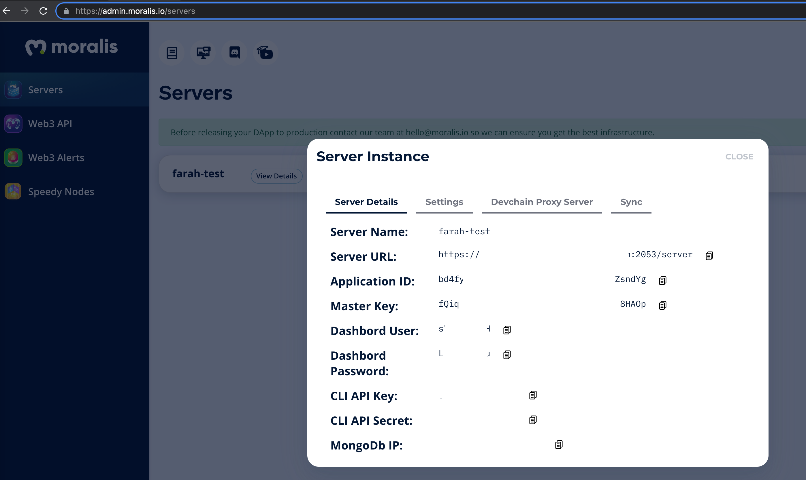

# Introduction

This is the collation of interesting materials around the usage of Moralis and Web3 and generating examples to play with as a coding exercise and an exploratory exercise around the use of the API.

- Many videos on the subject can be found at https://www.youtube.com/c/MoralisWeb3

- Sign up to setup a server @ https://admin.moralis.io/web3Api and play with the API as if you using a SWAGGER client

  

- An intro to Moralis can be found here at https://docs.moralis.io/moralis-server/web3-sdk/intro speaking up the rest framework

- An updated version of the Swagger API can be found at https://deep-index.moralis.io/api-docs/ if you want to try various API's online

- Setting up the client for usage can be found at https://docs.moralis.io/moralis-server/getting-started/quick-start was done in this exercise project for you using **Yarn** and the quickstart link with `yarn add moralis`

- If you are using VSCode, install the snippets for code completion at https://marketplace.visualstudio.com/items?itemName=MoralisWeb3.moralis-snippets or check the video on [how to use the snippets](https://youtu.be/X82YBwLf1Vk)

  

- Configure the **.env** file with you personal details to correlate with the values that would be used to actually get stuff back from the API

  ```json
  // .env file
  REACT_APP_MORALIS_APPLICATION_ID=<your application id generated online>
  REACT_APP_MORALIS_API_URL=https://<YourServer>/server
  ```

  

- Setup a Metamask wallet and the snippets in the project will hopefully help you understand the basics of connecting and showing stuff - Check [pre-requisites](https://docs.moralis.io/moralis-server/getting-started/pre-requisites) for more information

- Demo applications of all kinds can be found at https://github.com/MoralisWeb3/demo-apps to sample the API

## Getting Started with Create React App

This project was bootstrapped with [Create React App](https://github.com/facebook/create-react-app).

## Available Scripts

In the project directory, you can run:

### `yarn start`

Runs the app in the development mode.\
Open [http://localhost:3000](http://localhost:3000) to view it in the browser.

The page will reload if you make edits.\
You will also see any lint errors in the console.

### `yarn test`

Launches the test runner in the interactive watch mode.\
See the section about [running tests](https://facebook.github.io/create-react-app/docs/running-tests) for more information.

### `yarn build`

Builds the app for production to the `build` folder.\
It correctly bundles React in production mode and optimizes the build for the best performance.

The build is minified and the filenames include the hashes.\
Your app is ready to be deployed!

See the section about [deployment](https://facebook.github.io/create-react-app/docs/deployment) for more information.

### `yarn eject`

**Note: this is a one-way operation. Once you `eject`, you can’t go back!**

If you aren’t satisfied with the build tool and configuration choices, you can `eject` at any time. This command will remove the single build dependency from your project.

Instead, it will copy all the configuration files and the transitive dependencies (webpack, Babel, ESLint, etc) right into your project so you have full control over them. All of the commands except `eject` will still work, but they will point to the copied scripts so you can tweak them. At this point you’re on your own.

You don’t have to ever use `eject`. The curated feature set is suitable for small and middle deployments, and you shouldn’t feel obligated to use this feature. However we understand that this tool wouldn’t be useful if you couldn’t customize it when you are ready for it.

## Learn More

You can learn more in the [Create React App documentation](https://facebook.github.io/create-react-app/docs/getting-started).

To learn React, check out the [React documentation](https://reactjs.org/).

### Code Splitting

This section has moved here: [https://facebook.github.io/create-react-app/docs/code-splitting](https://facebook.github.io/create-react-app/docs/code-splitting)

### Analyzing the Bundle Size

This section has moved here: [https://facebook.github.io/create-react-app/docs/analyzing-the-bundle-size](https://facebook.github.io/create-react-app/docs/analyzing-the-bundle-size)

### Making a Progressive Web App

This section has moved here: [https://facebook.github.io/create-react-app/docs/making-a-progressive-web-app](https://facebook.github.io/create-react-app/docs/making-a-progressive-web-app)

### Advanced Configuration

This section has moved here: [https://facebook.github.io/create-react-app/docs/advanced-configuration](https://facebook.github.io/create-react-app/docs/advanced-configuration)

### Deployment

This section has moved here: [https://facebook.github.io/create-react-app/docs/deployment](https://facebook.github.io/create-react-app/docs/deployment)

### `yarn build` fails to minify

This section has moved here: [https://facebook.github.io/create-react-app/docs/troubleshooting#npm-run-build-fails-to-minify](https://facebook.github.io/create-react-app/docs/troubleshooting#npm-run-build-fails-to-minify)
